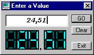



## LED Display

### Description

It's a LED Display to show numbers simply by loading small icons.

It also consider 2 decimal digits.

You can use this as an example to show numbers in your program in a more "electronical" way.
 
### More Info
 
A number (from 0 to 999,99)

You must use "," to separate decimal numbers, not "." For example enter 12,33 and not 12.33

The program anyway won't accept "." so you must use ","

A LED Display with the number entered

             |
---                |---
**Submitted On**   |2000-11-29 16:36:10
**By**             |[N/A](https://github.com/Planet-Source-Code/PSCIndex/blob/master/ByAuthor/empty.md)
**Level**          |Intermediate
**User Rating**    |4.0 (8 globes from 2 users)
**Compatibility**  |VB 6\.0
**Category**       |[Custom Controls/ Forms/  Menus](https://github.com/Planet-Source-Code/PSCIndex/blob/master/ByCategory/custom-controls-forms-menus__1-4.md)
**World**          |[Visual Basic](https://github.com/Planet-Source-Code/PSCIndex/blob/master/ByWorld/visual-basic.md)
**Archive File**   |[CODE\_UPLOAD122271212000\.zip](https://github.com/Planet-Source-Code/led-display__1-13238/archive/master.zip)

